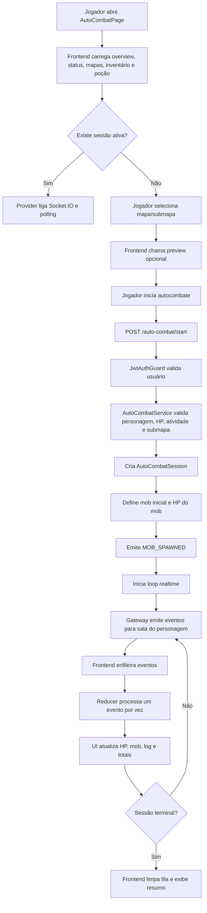

# Documentação Técnica — Sistema de Autocombate

## Escopo da Análise

Esta documentação é específica do sistema de autocombate do projeto `deadidlemmo/mmorpg-idle-zumbi`.

A análise considerou os arquivos acessíveis no repositório GitHub conectado, com foco em:

- backend NestJS;
- frontend React/Vite;
- banco de dados Prisma/PostgreSQL;
- migrations;
- rotas HTTP;
- WebSocket/Socket.IO;
- tipos, DTOs, hooks, contexts, reducers, componentes e páginas;
- arquivos de configuração;
- arquivos indiretamente relacionados, como inventário, consumíveis, equipamentos, mapas, mobs, atributos e activity guard.

Nenhum `git diff`, patch ou arquivo local adicional foi enviado junto desta solicitação. Portanto, pontos que dependem da versão local não enviada estão listados em **A Confirmar**.

---

## Visão Geral

O autocombate é um sistema de combate idle em que o jogador escolhe um submapa e inicia uma sessão automática para um personagem. A partir daí, o backend mantém uma sessão persistida, processa rodadas de combate, atualiza HP, XP, mobs, loot, poções automáticas e histórico de eventos. O frontend acompanha esse estado por API HTTP e por eventos em tempo real via Socket.IO.

Dentro da experiência do jogador, o autocombate se encaixa como uma atividade contínua de progressão. Ele permite que o personagem enfrente mobs de um submapa, acumule XP, abates, loot e eventos visuais sem exigir comandos manuais a cada rodada. A interface do frontend apresenta seleção de mapa/submapa, preview de risco, sessão ativa, HP do personagem, HP do mob, log de batalha, totais da sessão e configuração de poção automática.

O sistema é diferente do módulo de combate manual (`backend/src/modules/combat/*`). O módulo `combat` possui endpoint próprio para iniciar combate manual contra um mob específico, mas não representa a sessão idle/realtime de autocombate.

---

## Resumo Técnico

### Como o autocombate é iniciado

O início é feito pelo frontend chamando:

```http
POST /auto-combat/start
```

Arquivo backend:

```text
backend/src/modules/auto-combat/auto-combat.controller.ts
```

Payload confirmado pelo DTO:

```ts
{
  characterId: string; // UUID
  subMapId: string;    // UUID
}
```

Arquivo DTO:

```text
backend/src/modules/auto-combat/dto/start-auto-combat.dto.ts
```

O controller usa `JwtAuthGuard`, extrai `request.user.id` e chama:

```ts
this.autoCombatService.start(request.user.id, startAutoCombatDto)
```

No serviço:

```text
backend/src/modules/auto-combat/auto-combat.service.ts
```

o fluxo visível confirma que o backend:

1. busca o personagem pelo `characterId` e `userId`;
2. verifica se já existe sessão `ACTIVE`;
3. usa `ActivityGuardService.ensureCanStartAutoCombat`;
4. calcula atributos de combate do personagem;
5. valida se o personagem possui HP;
6. busca o submapa, mapa, encounters ativos, mobs e drops;
7. valida se o submapa existe;
8. valida se o submapa possui encounters ativos;
9. valida nível mínimo do submapa;
10. sorteia o primeiro encounter via `rollEncounter`;
11. cria uma sessão `AutoCombatSession`;
12. grava mob atual, HP do mob, rodada atual e índice do combate;
13. emite um evento inicial `MOB_SPAWNED`;
14. emite atualizações por Socket.IO;
15. inicia o loop de processamento em tempo real;
16. agenda processamento imediato.

### Como ele é pausado, parado ou finalizado

Há endpoint para parada manual:

```http
POST /auto-combat/:characterId/stop
```

O controller chama:

```ts
this.autoCombatService.stop(request.user.id, characterId)
```

A interface também chama `stopAutoCombat(characterId)` pelo arquivo:

```text
frontend/src/features/auto-combat/api/auto-combat.api.ts
```

O serviço possui tipos e eventos para status `STOPPED`, `FINISHED` e `DEFEATED`, e o banco usa o enum:

```prisma
enum AutoCombatSessionStatus {
  ACTIVE
  FINISHED
  STOPPED
  DEFEATED
}
```

O frontend trata sessões terminais com os status:

```text
FINISHED
STOPPED
DEFEATED
FAILED
CANCELLED
```

A implementação interna completa de `stop()` e do fechamento automático por tempo/derrota não ficou totalmente visível na saída truncada do conector, mas os endpoints, tipos, eventos, modelos e consumidores confirmam que o sistema diferencia sessão ativa, parada, finalizada e derrotada.

### Como o estado do combate é mantido

O estado canônico é persistido em PostgreSQL via Prisma nos modelos:

- `AutoCombatSession`;
- `AutoCombatSessionLoot`;
- `AutoCombatSessionMobSummary`;
- `AutoCombatSessionEvent`.

O estado visual/realtime é mantido no frontend por:

```text
frontend/src/features/auto-combat/realtime/AutoCombatRealtimeProvider.tsx
frontend/src/features/auto-combat/realtime/autoCombatRealtime.reducer.ts
frontend/src/features/auto-combat/realtime/autoCombatRealtime.types.ts
frontend/src/features/auto-combat/realtime/autoCombatRealtime.utils.ts
frontend/src/features/auto-combat/hooks/useAutoCombatSocket.ts
```

O backend também mantém estado transitório em memória no serviço:

```ts
realtimeIntervals: Map<string, ReturnType<typeof setInterval>>
processingLocks: Set<string>
potionUsageByCombat: Set<string>
```

Esses campos indicam uso de intervalos por personagem/sessão, lock local de processamento e controle local de uso de poção por combate.

### Como o frontend consulta ou envia dados

O frontend usa HTTP para:

- listar mapas;
- buscar status da sessão;
- consultar eventos recentes;
- gerar preview;
- iniciar autocombate;
- parar autocombate;
- buscar inventário para poções;
- buscar/atualizar configuração de poção automática.

Arquivos principais:

```text
frontend/src/features/auto-combat/api/auto-combat.api.ts
frontend/src/services/api/apiClient.ts
frontend/src/services/api/endpoints.ts
frontend/src/features/auto-combat/utils/auto-combat-page.helpers.ts
```

Também usa Socket.IO no namespace:

```text
/auto-combat
```

Arquivo:

```text
frontend/src/services/websocket/socketClient.ts
```

O cliente envia:

```text
auto-combat:join
auto-combat:leave
```

E escuta eventos como:

```text
auto-combat:status
auto-combat:session-updated
auto-combat:finished
auto-combat:stopped
auto-combat:event
auto-combat:mob-spawned
auto-combat:hit
auto-combat:dodge
auto-combat:mob-defeated
auto-combat:player-defeated
auto-combat:potion-used
```

### Como o backend processa o combate

O processamento principal está concentrado em:

```text
backend/src/modules/auto-combat/auto-combat.service.ts
```

O serviço importa e usa regras de apoio de:

```text
backend/src/common/utils/combat-damage.util.ts
backend/src/common/utils/farm-penalty.util.ts
backend/src/common/utils/level.util.ts
backend/src/common/utils/stats.util.ts
backend/src/common/config/auto-combat.config.ts
```

Pelo código visível, a sessão usa:

- duração máxima de 6 horas;
- duração de rodada configurada;
- tick realtime de 1000 ms no serviço;
- lock local de processamento;
- eventos de combate em tempo real;
- atualização persistente de sessão, mob atual, rodadas, XP, loot, poções e eventos.

### Como eventos de combate são registrados

O schema define:

```prisma
model AutoCombatSessionEvent {
  id          String   @id @default(uuid())
  sessionId   String
  characterId String
  type        String
  sequence    Int
  payloadJson Json
  createdAt   DateTime @default(now())
}
```

A migration `20260503151005_add_auto_combat_session_events` cria a tabela:

```text
auto_combat_session_events
```

com `payloadJson JSONB`, índice por sessão/personagem/tipo/data e chave única:

```text
(sessionId, sequence)
```

O endpoint:

```http
GET /auto-combat/:characterId/recent-events
```

consulta os eventos da última sessão ou sessão ativa, ordena por `sequence desc`, limita em 20 e devolve em ordem cronológica.

### Como recompensas, dano, vida, inimigos e histórico são tratados

Confirmado no código:

- dano é calculado por `calculateCombatHit`;
- atributos do personagem são calculados por `calculateFullStats`;
- XP e progressão são calculados por `calculateLevelProgress` e `getLevelProgress`;
- penalidade por farm de tier inferior é calculada por `calculateTierFarmPenalty`;
- loot é modelado em `AutoCombatSessionLoot`;
- abates/XP por mob são modelados em `AutoCombatSessionMobSummary`;
- mobs são escolhidos a partir de `SubMapEncounter`, com campo `weight`;
- vida do mob atual é persistida em `AutoCombatSession.currentMobHp/currentMobMaxHp`;
- vida do personagem é persistida em `Character.currentHp/maxHp`;
- histórico visual é exibido por `AutoCombatBattleLog`.

---

## Mapa de Arquivos Relacionados

| Arquivo | Camada | Relação com o autocombate | Importância |
|---|---|---|---|
| `backend/src/modules/auto-combat/auto-combat.controller.ts` | Backend | Define rotas HTTP do autocombate e aplica `JwtAuthGuard`. | Alta |
| `backend/src/modules/auto-combat/auto-combat.service.ts` | Backend | Serviço central: inicia sessão, valida personagem/submapa, processa sessão, emite eventos, consulta status e eventos recentes. | Alta |
| `backend/src/modules/auto-combat/auto-combat.gateway.ts` | Backend | Gateway Socket.IO `/auto-combat`, autenticação WebSocket, salas por personagem e emissão de eventos realtime. | Alta |
| `backend/src/modules/auto-combat/auto-combat.module.ts` | Backend | Registra controller, service, gateway, Prisma, ActivityGuard e JWT. | Alta |
| `backend/src/modules/auto-combat/dto/start-auto-combat.dto.ts` | Backend | Valida `characterId` e `subMapId` como UUID. | Alta |
| `backend/src/modules/auto-combat/dto/preview-auto-combat.dto.ts` | Backend | Valida payload de preview, `projectionSeconds` e `iterations`. | Alta |
| `backend/src/common/config/auto-combat.config.ts` | Configuração | Define duração da sessão, duração da rodada, limite de processamento e finalização por tempo. | Alta |
| `backend/src/common/activity-guard/activity-guard.service.ts` | Backend | Impede autocombate com personagem inválido, sem HP, já em gathering ou já em autocombate. | Alta |
| `backend/src/common/utils/combat-damage.util.ts` | Backend | Fórmulas confirmadas de dano, variação, crítico e esquiva. | Alta |
| `backend/src/common/utils/farm-penalty.util.ts` | Backend | Penalidades de XP e drop por diferença de tier. | Alta |
| `backend/src/common/utils/level.util.ts` | Backend | Cálculo de XP, level e barra de progresso. | Alta |
| `backend/src/common/utils/stats.util.ts` | Backend | Cálculo de atributos totais e derivados de combate. | Alta |
| `backend/src/common/utils/level-stats.util.ts` | Backend | Afinidades de classe e bônus por nível. | Média |
| `backend/prisma/schema.prisma` | Banco de dados | Define models, enums e relações do autocombate. | Alta |
| `backend/prisma/migrations/20260426151029_add_auto_combat_submaps/migration.sql` | Banco de dados | Cria submapas, encounters, sessões, loots e resumo por mob. | Alta |
| `backend/prisma/migrations/20260430022747_add_auto_combat_realtime_state/migration.sql` | Banco de dados | Adiciona estado realtime do mob atual, rodada e índice do combate. | Alta |
| `backend/prisma/migrations/20260501221440_add_auto_combat_total_potions_used/migration.sql` | Banco de dados | Adiciona contador de poções usadas. | Alta |
| `backend/prisma/migrations/20260503151005_add_auto_combat_session_events/migration.sql` | Banco de dados | Cria histórico persistido de eventos do autocombate. | Alta |
| `backend/prisma/seed.ts` | Banco de dados | Seed seguro de classes, mapas, submapas, mobs, drops, itens e encounters usados pelo autocombate. | Média |
| `backend/prisma/seed.reset.ts` | Banco de dados | Reset destrutivo que recria dados-base e apaga sessões/progresso. | Média |
| `frontend/src/app/routes.tsx` | Frontend | Registra rota `/dashboard/:characterId/auto-combat` e envolve dashboard com realtime providers. | Alta |
| `frontend/src/services/api/apiClient.ts` | Frontend | Cliente Axios com `VITE_API_URL`, Bearer token e remoção de token em 401. | Alta |
| `frontend/src/services/api/endpoints.ts` | Frontend | Centraliza endpoints de autocombate, mapas e gathering. | Média |
| `frontend/src/services/websocket/socketClient.ts` | Frontend | Cliente Socket.IO do namespace `/auto-combat`. | Alta |
| `frontend/src/features/auto-combat/api/auto-combat.api.ts` | Frontend | Funções HTTP para mapas, status, eventos recentes, preview, start e stop. | Alta |
| `frontend/src/features/auto-combat/pages/AutoCombatPage.tsx` | Frontend | Página principal do autocombate, seleção, preview, sessão, poções e UI. | Alta |
| `frontend/src/features/auto-combat/realtime/AutoCombatRealtimeProvider.tsx` | Frontend | Context provider que combina polling, Socket.IO, reconciliação e fila visual. | Alta |
| `frontend/src/features/auto-combat/realtime/autoCombatRealtime.reducer.ts` | Frontend | Reducer com estado realtime, fila, logs, de-duplicação e proteção contra rollback. | Alta |
| `frontend/src/features/auto-combat/realtime/autoCombatRealtime.types.ts` | Frontend | Tipos do estado realtime e contexto. | Alta |
| `frontend/src/features/auto-combat/realtime/autoCombatRealtime.utils.ts` | Frontend | Normalização de eventos/status, delays visuais e builders de estado. | Alta |
| `frontend/src/features/auto-combat/realtime/useAutoCombatRealtime.ts` | Frontend | Hooks de acesso ao contexto realtime. | Média |
| `frontend/src/features/auto-combat/hooks/useAutoCombatSocket.ts` | Frontend | Hook de conexão, join/leave, listeners e deduplicação de eventos Socket.IO. | Alta |
| `frontend/src/features/auto-combat/types/auto-combat.types.ts` | Frontend | Contratos de payload/resposta, eventos, status, sessão, recompensas e preview. | Alta |
| `frontend/src/features/auto-combat/types/auto-combat-page.types.ts` | Frontend | Tipos auxiliares da página, poção e estado realtime loose. | Média |
| `frontend/src/features/auto-combat/utils/auto-combat-page.helpers.ts` | Frontend | Helpers de status, mapas, submapas, poções, totais, progressão e chamadas relacionadas. | Alta |
| `frontend/src/features/auto-combat/components/AutoCombatBattleLog.tsx` | Frontend | Renderiza histórico visual dos eventos de combate. | Alta |
| `frontend/src/features/auto-combat/components/AutoCombatSessionSummary.tsx` | Frontend | Renderiza totais da sessão. | Média |
| `frontend/src/features/auto-combat/components/AutoCombatStatsTab.tsx` | Frontend | Exibe atributos primários do personagem. | Média |
| `frontend/src/features/auto-combat/components/AutoCombatAppHeader.tsx` | Frontend | Header da tela de autocombate. | Baixa |
| `frontend/src/features/auto-combat/components/AutoCombatTabs.tsx` | Frontend | Alternância entre abas da tela. | Baixa |
| `frontend/src/features/auto-combat/assets/auto-combat-map-assets.ts` | Frontend | Assets visuais de mapas para a tela. | Baixa |
| `frontend/src/features/auto-combat/utils/mobAssets.ts` | Frontend | Resolve imagens de mobs. | Baixa |
| `frontend/src/features/dashboard/components/DashboardActivityBar.tsx` | Frontend | Exibe atividade ativa de autocombate no dashboard, consumindo realtime state. | Média |
| `backend/src/modules/inventory/inventory.controller.ts` | Backend | Endpoint usado pelo frontend para buscar poções no inventário. | Indireta |
| `backend/src/modules/consumables/consumables.controller.ts` | Backend | Configuração e uso de consumíveis/poções, usados pelo autocombate automático. | Indireta |
| `backend/src/modules/equipment/equipment.controller.ts` | Backend | Equipamentos afetam atributos do personagem usados no combate. | Indireta |
| `backend/src/modules/maps/maps.controller.ts` | Backend | Lista mapas/submapas usados pela seleção de autocombate. | Indireta |
| `backend/src/modules/mobs/mobs.controller.ts` | Backend | Mobs fazem parte dos encontros, mas o controller é listagem geral. | Indireta |
| `backend/src/modules/items/items.controller.ts` | Backend | Itens são usados em drops/loot, mas o controller é listagem geral. | Indireta |
| `backend/src/modules/combat/*` | Backend | Combate manual. Parece relacionado, mas não é o sistema de autocombate. | Baixa |
| `backend/src/modules/gathering/*` | Backend | Gathering compete com autocombate via ActivityGuard, mas não processa autocombate. | Indireta |
| `backend/src/modules/crafting/*` | Backend | Crafting pode consumir materiais/loot, mas não processa autocombate. | Indireta |
| `frontend/src/features/gathering/*` | Frontend | Gathering aparece junto no dashboard, mas não é autocombate. | Indireta |
| `frontend/src/features/inventory/*` | Frontend | Estrutura existe, mas a integração de inventário usada no autocombate está no helper da página. | Indireta |

---

## Backend do Autocombate

### Módulo

Arquivo:

```text
backend/src/modules/auto-combat/auto-combat.module.ts
```

Responsabilidades confirmadas:

- importa `PrismaModule`;
- importa `ActivityGuardModule`;
- registra `JwtModule` com segredo `JWT_SECRET`;
- registra `AutoCombatController`;
- registra `AutoCombatService`;
- registra `AutoCombatGateway`;
- exporta `AutoCombatService`.

### Controller

Arquivo:

```text
backend/src/modules/auto-combat/auto-combat.controller.ts
```

Controller:

```ts
@Controller('auto-combat')
@UseGuards(JwtAuthGuard)
export class AutoCombatController
```

Todas as rotas deste controller exigem autenticação JWT.

Endpoints confirmados:

| Método | Rota | Chamada interna |
|---|---|---|
| `POST` | `/auto-combat/start` | `autoCombatService.start(userId, dto)` |
| `POST` | `/auto-combat/preview` | `autoCombatService.preview(userId, dto)` |
| `GET` | `/auto-combat/:characterId/status` | `autoCombatService.getStatus(userId, characterId)` |
| `GET` | `/auto-combat/:characterId/recent-events` | `autoCombatService.getRecentEvents(userId, characterId)` |
| `POST` | `/auto-combat/:characterId/stop` | `autoCombatService.stop(userId, characterId)` |

### DTOs e validação

#### `StartAutoCombatDto`

Arquivo:

```text
backend/src/modules/auto-combat/dto/start-auto-combat.dto.ts
```

Campos:

| Campo | Validação |
|---|---|
| `characterId` | `@IsUUID()` |
| `subMapId` | `@IsUUID()` |

#### `PreviewAutoCombatDto`

Arquivo:

```text
backend/src/modules/auto-combat/dto/preview-auto-combat.dto.ts
```

Campos:

| Campo | Validação |
|---|---|
| `characterId` | `@IsUUID()` |
| `subMapId` | `@IsUUID()` |
| `projectionSeconds` | opcional, inteiro, mínimo `5`, máximo `21600` |
| `iterations` | opcional, inteiro, mínimo `1`, máximo `14` |

Além disso, o `main.ts` aplica `ValidationPipe` global com:

```ts
whitelist: true
forbidNonWhitelisted: true
transform: true
```

Isso remove campos não esperados, bloqueia campos extras e transforma tipos quando possível.

### Service

Arquivo:

```text
backend/src/modules/auto-combat/auto-combat.service.ts
```

O `AutoCombatService` é o núcleo do sistema.

#### Dependências injetadas

```ts
constructor(
  private readonly prisma: PrismaService,
  private readonly activityGuard: ActivityGuardService,
  private readonly autoCombatGateway: AutoCombatGateway,
) {}
```

#### Dependências importadas

O serviço importa regras e utilitários relevantes:

```text
backend/src/common/config/auto-combat.config.ts
backend/src/common/utils/combat-damage.util.ts
backend/src/common/utils/farm-penalty.util.ts
backend/src/common/utils/level.util.ts
backend/src/common/utils/stats.util.ts
```

#### Estado em memória

O serviço mantém:

```ts
realtimeIntervals: Map<string, ReturnType<typeof setInterval>>
processingLocks: Set<string>
potionUsageByCombat: Set<string>
```

Interpretação confirmada pelo nome e uso visível:

- `realtimeIntervals`: controla loops/intervalos de processamento realtime;
- `processingLocks`: evita processamento concorrente local;
- `potionUsageByCombat`: controla uso de poção por combate/sessão no processo atual.

O método `onModuleDestroy` limpa intervalos e sets.

#### Início da sessão

No método `start`, o backend:

1. busca personagem por `id` e `userId`;
2. inclui classe e equipamentos equipados;
3. verifica sessão ativa existente;
4. se houver sessão ativa:
   - ajusta duração responsiva quando necessário;
   - reinicia loop realtime;
   - retorna resposta da sessão ativa;
   - emite `session-updated` e `status`;
5. chama `ActivityGuardService.ensureCanStartAutoCombat`;
6. calcula stats do personagem;
7. bloqueia início se HP <= 0;
8. busca submapa com mapa, encounters ativos, mobs e drops;
9. bloqueia se submapa não existir;
10. bloqueia se não houver mobs configurados;
11. bloqueia se personagem não atingiu nível mínimo;
12. sorteia o primeiro encounter;
13. cria sessão com:
    - status `ACTIVE`;
    - `startedAt`;
    - `endsAt`;
    - `lastProcessedAt`;
    - duração máxima;
    - duração de rodada;
    - mob atual;
    - HP atual e máximo do mob;
    - rodada atual `0`;
    - índice de combate `1`;
14. atualiza personagem com:
    - `mapId`;
    - `maxHp`;
    - `currentHp`;
15. emite evento inicial `MOB_SPAWNED`;
16. inicia loop realtime;
17. agenda processamento imediato.

#### Preview

O método `preview`:

1. busca personagem por `id` e `userId`;
2. inclui classe, equipamentos, configuração de poção e inventário;
3. busca submapa com encounters ativos;
4. valida submapa, mobs, nível mínimo e HP;
5. normaliza `projectionSeconds`;
6. chama `buildAutoCombatPreview`;
7. retorna:
   - personagem;
   - submapa;
   - `combatPreview`.

O preview possui campos esperados no frontend:

```ts
averageCombatDurationSeconds
averageRoundsPerCombat
xpPerMinute
risk
critical
dodge
hp
sample
```

#### Status

O método `getStatus`:

1. valida personagem por `id` e `userId`;
2. procura sessão ativa;
3. se existir:
   - ajusta duração responsiva;
   - inicia loop realtime;
   - monta resposta da sessão;
   - emite `auto-combat:status`;
4. se não existir sessão ativa:
   - para loop realtime;
   - procura a última sessão;
   - se existir, retorna última sessão;
   - se não existir, retorna estado inativo com snapshot do personagem.

#### Eventos recentes

O método `getRecentEvents`:

1. valida personagem por `id` e `userId`;
2. procura sessão ativa;
3. se não houver sessão ativa, procura última sessão;
4. se não houver sessão, retorna lista vazia;
5. consulta `autoCombatSessionEvent` por `sessionId` e `characterId`;
6. ordena por `sequence desc`;
7. limita em `AUTO_COMBAT_RECENT_EVENTS_LIMIT`, confirmado como `20`;
8. reverte para ordem cronológica;
9. retorna payload enriquecido com:
   - `id`;
   - `eventId`;
   - `sessionId`;
   - `characterId`;
   - `type`;
   - `sequence`;
   - `createdAt`.

### Gateway Socket.IO

Arquivo:

```text
backend/src/modules/auto-combat/auto-combat.gateway.ts
```

Namespace:

```ts
@WebSocketGateway({
  namespace: '/auto-combat',
  cors: {
    origin: true,
    credentials: true,
  },
})
```

#### Autenticação do socket

O gateway tenta extrair token de:

- `client.handshake.auth.token`;
- `client.handshake.auth.accessToken`;
- `client.handshake.query.token`;
- `client.handshake.query.accessToken`;
- header `authorization`.

Depois valida com `JwtService.verifyAsync`.

Se o usuário não for encontrado, emite erro e desconecta.

#### Rooms

O gateway usa:

```ts
user:${userId}
auto-combat:character:${characterId}
```

O join só é permitido quando:

- o socket está autenticado;
- `characterId` foi informado;
- o personagem pertence ao usuário;
- `deletedAt` é `null`.

#### Eventos recebidos do cliente

| Evento | Payload | Descrição |
|---|---|---|
| `auto-combat:join` | `{ characterId }` | Entra na sala realtime do personagem. |
| `auto-combat:leave` | `{ characterId }` | Sai da sala realtime do personagem. |

#### Eventos emitidos pelo servidor

| Evento | Origem no gateway |
|---|---|
| `auto-combat:connected` | conexão autenticada |
| `auto-combat:joined` | join bem-sucedido |
| `auto-combat:left` | leave bem-sucedido |
| `auto-combat:error` | erro do socket ou domínio |
| `auto-combat:status` | snapshot de status |
| `auto-combat:session-updated` | sessão atualizada |
| `auto-combat:finished` | sessão finalizada |
| `auto-combat:stopped` | sessão parada |
| `auto-combat:event` | evento genérico emitido junto dos eventos específicos |
| `auto-combat:mob-spawned` | mob apareceu |
| `auto-combat:hit` | hit de jogador ou mob |
| `auto-combat:dodge` | esquiva |
| `auto-combat:mob-defeated` | mob derrotado |
| `auto-combat:player-defeated` | personagem derrotado |
| `auto-combat:potion-used` | poção automática usada |

O gateway também possui supressão de `status` inativo duplicado por personagem, baseada em assinatura JSON.

### Configuração de autocombate

Arquivo:

```text
backend/src/common/config/auto-combat.config.ts
```

Valores confirmados:

| Constante | Valor | Significado |
|---|---:|---|
| `AUTO_COMBAT_SESSION_DURATION_SECONDS` | `21600` | Duração máxima de 6 horas. |
| `AUTO_COMBAT_ROUND_DURATION_SECONDS` | `3` | Duração configurada de cada rodada. |
| `AUTO_COMBAT_MAX_COMBATS_PER_PROCESS` | `5000` | Limite de segurança para processamento. |
| `AUTO_COMBAT_MAX_SECONDS_PER_PROCESS` | `21600` | Máximo processável por chamada. |
| `AUTO_COMBAT_FINISH_SESSION_WHEN_TIME_ENDS` | `true` | Sessão deve finalizar ao atingir `endsAt`. |

Observação: a migration `20260430022747_add_auto_combat_realtime_state` alterou default de `roundDurationSeconds` para `1`, mas o serviço grava o valor efetivo vindo da configuração ao criar novas sessões. O próprio comentário da configuração informa que sessões antigas continuam com valor antigo.

### Activity Guard

Arquivo:

```text
backend/src/common/activity-guard/activity-guard.service.ts
```

Regras confirmadas para iniciar autocombate:

- personagem deve existir;
- personagem deve estar `ACTIVE`;
- personagem deve ter HP > 0;
- personagem não pode estar em gathering ativo;
- personagem não pode já possuir autocombate ativo.

O mesmo service impede:

- iniciar gathering durante autocombate;
- usar enfermaria durante autocombate.

### Regras de dano

Arquivo:

```text
backend/src/common/utils/combat-damage.util.ts
```

#### Dano base

```ts
safeAttack = max(1, attack)
safeDefense = max(0, defense)
defenseScale = 2
maxReductionRate = 0.75
minimumDamageRate = 0.15
reductionRate = min(0.75, defense / (defense + attack * 2))
reducedDamage = floor(attack * (1 - reductionRate))
minimumDamage = max(1, ceil(attack * 0.15))
baseDamage = max(minimumDamage, reducedDamage)
```

#### Variação

```ts
minMultiplier = 0.9
maxMultiplier = 1.1
finalDamage = floor(baseDamage * randomMultiplier)
```

respeitando o dano mínimo.

#### Esquiva

```ts
rawDodgeChance = 5 + (defenderAgility - attackerPrecision) * 0.75
dodgeChance = clamp(rawDodgeChance, 1, 35)
isDodged = randomPercent() <= dodgeChance
```

Se esquivar:

- `finalDamage = 0`;
- crítico não é aplicado.

#### Crítico

```ts
rawCriticalChance =
  5 + attackerPrecision * 0.25 + attackerTechnique * 0.15 - defenderAgility * 0.1

criticalChance = clamp(rawCriticalChance, 5, 35)

criticalMultiplier = clamp(1.5 + attackerTechnique * 0.005, 1.5, 2)
```

Se crítico:

```ts
finalDamage = max(damageBeforeCritical + 1, floor(damageBeforeCritical * criticalMultiplier))
criticalBonusDamage = finalDamage - damageBeforeCritical
```

### Atributos de combate

Arquivo:

```text
backend/src/common/utils/stats.util.ts
```

O cálculo completo usa:

- atributos base da classe;
- bônus por nível;
- bônus de equipamentos;
- atributos derivados.

Fórmulas confirmadas:

```ts
maxHp = 120 + ((level - 1) * 12) + vitality * 6 + willpower * 3 + classHpBonus
defense = vitality + willpower
speed = agility
```

Ataque por classe:

| Classe | Fórmula |
|---|---|
| Lutador | `strength * 2` |
| Atirador | `precision * 2` |
| Assassino | `agility + precision` |
| Médico | `technique + precision` |
| Fallback | `strength + precision` |

### Penalidade de farm

Arquivo:

```text
backend/src/common/utils/farm-penalty.util.ts
```

Tier do personagem:

```ts
ceil(level / 10)
```

Multiplicadores confirmados:

| Diferença de tier | XP | Drop raro/equipamento | Drop comum/material/consumível |
|---:|---:|---:|---:|
| `<= 0` | `1` | `1` | `1` |
| `1` | `0.35` | `0.6` | `0.9` |
| `2` | `0.1` | `0.3` | `0.7` |
| `>= 3` | `0.03` | `0.1` | `0.5` |

O código considera drop raro/equipamento quando `itemSlot !== 'MATERIAL' && itemSlot !== 'CONSUMABLE'`.

### Progressão de nível

Arquivos:

```text
backend/src/common/config/progression.config.ts
backend/src/common/utils/level.util.ts
```

Configuração confirmada:

- `LAUNCH_LEVEL_CAP = 50`;
- `FUTURE_LEVEL_CAP = 100`;
- `LEVELS_PER_TIER = 10`;
- `EXPECTED_COMBATS_PER_DAY = 120`;
- metas por tier em dias;
- XP médio por combate por tier.

O cálculo de level usa XP total acumulado e não reduz o nível salvo caso o XP calculado indique nível inferior ao atual.

---

## Frontend do Autocombate

### Rota

Arquivo:

```text
frontend/src/app/routes.tsx
```

Rota confirmada:

```text
/dashboard/:characterId/auto-combat
```

Essa rota fica dentro de:

```tsx
<AutoCombatRealtimeProvider
  characterId={characterId}
  autoLoad
  refreshMs={3000}
>
  <GatheringRealtimeProvider ...>
    <Outlet />
  </GatheringRealtimeProvider>
</AutoCombatRealtimeProvider>
```

Portanto, ao entrar no dashboard, o estado realtime do autocombate já é disponibilizado para páginas internas.

### Cliente HTTP

Arquivos:

```text
frontend/src/services/api/apiClient.ts
frontend/src/services/api/endpoints.ts
frontend/src/features/auto-combat/api/auto-combat.api.ts
```

O Axios:

- usa `VITE_API_URL`;
- fallback `http://localhost:3000`;
- envia `Content-Type: application/json`;
- inclui `Authorization: Bearer <token>`;
- remove token quando recebe HTTP `401`;
- timeout de 15 segundos.

Funções específicas do autocombate:

```ts
getAutoCombatMaps()
getAutoCombatMapById(mapId)
getAutoCombatStatus(characterId)
getAutoCombatRecentEvents(characterId)
previewAutoCombat(payload)
startAutoCombat(payload)
stopAutoCombat(characterId)
```

### Cliente WebSocket

Arquivo:

```text
frontend/src/services/websocket/socketClient.ts
```

O cliente Socket.IO:

- usa `VITE_SOCKET_URL`, quando disponível;
- caso contrário usa `VITE_API_URL`;
- fallback `http://localhost:3000`;
- remove sufixos `/api` e `/auto-combat` antes de montar a URL;
- conecta no namespace `/auto-combat`;
- envia token no campo `auth`;
- usa transports `websocket` e `polling`;
- usa `withCredentials: true`;
- configura reconexão.

### Hook Socket

Arquivo:

```text
frontend/src/features/auto-combat/hooks/useAutoCombatSocket.ts
```

Responsabilidades:

- verificar `characterId` e token;
- conectar Socket.IO;
- configurar `currentSocket.auth = { token }`;
- emitir `auto-combat:join`;
- emitir `auto-combat:leave` no cleanup;
- registrar listeners para todos os eventos;
- filtrar status/eventos de outro personagem;
- deduplicar eventos com chaves e fingerprints;
- tratar erro de token, personagem não encontrado e conexão;
- encaminhar eventos para callbacks do provider.

### Provider realtime

Arquivo:

```text
frontend/src/features/auto-combat/realtime/AutoCombatRealtimeProvider.tsx
```

Responsabilidades:

- manter estado com `useReducer`;
- fazer reload inicial;
- buscar overview e status em paralelo;
- agendar reload após start/stop;
- consultar eventos recentes para reconciliação;
- ligar/desligar Socket.IO conforme sessão/estado;
- enfileirar eventos;
- processar apenas um evento visual por vez;
- pausar/flush visual em blur, hidden e retorno de página;
- evitar aceitar eventos de outra sessão/personagem;
- tratar sessões terminais;
- expor actions:
  - `reload`;
  - `start`;
  - `stop`;
  - `hydrateOverview`;
  - `hydrateStatus`;
  - `enqueueRealtimeEvent`;
  - `clearRealtimeQueue`;
  - `clearSessionVisualState`.

### Reducer realtime

Arquivo:

```text
frontend/src/features/auto-combat/realtime/autoCombatRealtime.reducer.ts
```

Estado principal:

```ts
characterId
isConnected
isJoined
errorMessage
hasLoadedOnce
status
session
character
mob
totals
displayTotals
visual
location
potion
eventQueue
activeEvent
battleLogEvents
processedEventKeys
queuedEventKeys
lastAppliedEventSequence
lastAppliedEventTimestamp
```

Constantes confirmadas:

| Constante | Valor |
|---|---:|
| `MAX_QUEUE_SIZE` | `80` |
| `MAX_BATTLE_LOG_SIZE` | `100` |
| `MAX_EVENT_CACHE_SIZE` | `700` |
| `MAX_FINGERPRINT_CACHE_SIZE` | `350` |

Regras frontend importantes:

- mantém `totals` canônicos separados de `displayTotals`;
- `displayTotals` só avança com eventos visualmente relevantes;
- evita mostrar XP/abates antes do evento visual `MOB_DEFEATED`;
- possui anti-rollback de HP de mob e personagem quando status antigo chega depois de evento realtime;
- usa fingerprints para evitar eventos duplicados;
- preserva último mob conhecido quando status ativo não traz mob confiável.

### Utils realtime

Arquivo:

```text
frontend/src/features/auto-combat/realtime/autoCombatRealtime.utils.ts
```

Delays visuais confirmados:

| Evento | Delay |
|---|---:|
| `MOB_SPAWNED` | `350 ms` |
| demais eventos principais | `950 ms` |
| default | `950 ms` |

Eventos reconhecidos:

```text
MOB_SPAWNED
PLAYER_HIT
MOB_HIT
DODGE
POTION_USED
MOB_DEFEATED
PLAYER_DEFEATED
```

Também há normalização de status, cálculo de percentuais de HP, fingerprints, deduplicação e montagem de estados de personagem/mob/sessão a partir de status e eventos.

### Página principal

Arquivo:

```text
frontend/src/features/auto-combat/pages/AutoCombatPage.tsx
```

Responsabilidades confirmadas:

- carregar overview do personagem;
- carregar status do autocombate;
- carregar mapas/submapas;
- carregar inventário;
- carregar configuração de poção automática;
- selecionar mapa e submapa;
- gerar preview de combate;
- renderizar sessão ativa;
- renderizar log de batalha;
- renderizar resumo da sessão;
- gerenciar configuração visual de poção automática;
- usar o contexto realtime para start/stop;
- fazer polling de fallback a cada 5 segundos quando existe sessão ativa e o socket não está conectado.

### Battle Log

Arquivo:

```text
frontend/src/features/auto-combat/components/AutoCombatBattleLog.tsx
```

Responsabilidades:

- combinar `events` e `activeEvent`;
- deduplicar eventos;
- ordenar por:
  1. `combatIndex`;
  2. `round`;
  3. `createdAt`;
  4. ordem do tipo de evento;
  5. índice original;
- esconder spawns repetidos;
- exibir mensagem, ator, ação, rodada e resultado;
- rolar automaticamente para o final;
- usar `role="log"` e `aria-live="polite"` quando ativo.

Tipos visuais:

```text
spawn
player-hit
mob-hit
dodge
potion
mob-defeated
player-defeated
system
```

Resultados exibidos:

- dano;
- crítico;
- XP;
- cura;
- esquiva;
- derrota;
- info.

### Resumo da sessão

Arquivo:

```text
frontend/src/features/auto-combat/components/AutoCombatSessionSummary.tsx
```

Exibe:

- status;
- combate atual;
- lutas resolvidas;
- abates;
- XP ganho;
- loot;
- poções usadas.

### Stats tab

Arquivo:

```text
frontend/src/features/auto-combat/components/AutoCombatStatsTab.tsx
```

Exibe atributos primários do personagem, a partir de `STAT_CARDS`.

### Dashboard Activity Bar

Arquivo:

```text
frontend/src/features/dashboard/components/DashboardActivityBar.tsx
```

É indiretamente relacionado, mas importante para UX. Ele consome o estado realtime do autocombate para exibir no dashboard:

- atividade ativa;
- personagem;
- HP do personagem;
- XP do personagem;
- mob atual;
- HP do mob;
- combate atual;
- abates;
- XP;
- link para a tela de autocombate.

---

## Fluxo Completo do Sistema

### Fluxo de início

1. Jogador acessa `/dashboard/:characterId/auto-combat`.
2. `AutoCombatRealtimeProvider` já está montado na rota do dashboard.
3. `AutoCombatPage` carrega:
   - overview do personagem;
   - status do autocombate;
   - mapas;
   - inventário;
   - configuração de poção.
4. Jogador seleciona mapa/submapa.
5. Frontend pode chamar `POST /auto-combat/preview` para exibir projeção.
6. Jogador inicia o autocombate.
7. Frontend chama `startAutoCombat(payload)`.
8. Backend valida JWT.
9. Backend valida personagem, HP e atividade concorrente.
10. Backend valida submapa, nível mínimo e encounters.
11. Backend sorteia mob inicial.
12. Backend cria `AutoCombatSession`.
13. Backend atualiza HP/mapa do personagem.
14. Backend emite evento `MOB_SPAWNED`.
15. Backend inicia loop realtime.
16. Frontend hidrata status, enfileira evento inicial e passa a escutar Socket.IO.

### Fluxo realtime

1. Socket conecta no namespace `/auto-combat`.
2. Cliente envia `auto-combat:join` com `characterId`.
3. Gateway valida usuário e personagem.
4. Gateway adiciona socket à sala `auto-combat:character:<id>`.
5. Backend emite eventos específicos e genéricos.
6. Hook `useAutoCombatSocket` deduplica e encaminha eventos.
7. Provider valida sessão/personagem e adiciona à fila.
8. Reducer processa um evento por vez.
9. UI atualiza HP, mob, log, totais visuais e mensagens.
10. Quando aba perde foco, provider faz flush visual e reconcilia com eventos recentes ao retornar.

### Fluxo de parada

1. Jogador solicita parada.
2. Frontend chama `stopAutoCombat(characterId)`.
3. Backend executa `AutoCombatService.stop`.
4. Backend retorna novo status.
5. Frontend hidrata status.
6. Provider limpa fila visual e cancela reloads pendentes.
7. Socket pode receber `auto-combat:stopped`.

A implementação interna completa de persistência da parada não ficou totalmente visível na saída truncada, mas endpoint, chamada, tipos e eventos estão confirmados.

---

## Diagrama de Fluxo



---

## API e Endpoints Relacionados

### Endpoints principais

| Método | Endpoint | Arquivo | Descrição | Autenticação |
|---|---|---|---|---|
| `POST` | `/auto-combat/start` | `backend/src/modules/auto-combat/auto-combat.controller.ts` | Inicia ou retorna sessão ativa de autocombate. | JWT |
| `POST` | `/auto-combat/preview` | `backend/src/modules/auto-combat/auto-combat.controller.ts` | Gera preview/projeção de autocombate. | JWT |
| `GET` | `/auto-combat/:characterId/status` | `backend/src/modules/auto-combat/auto-combat.controller.ts` | Consulta sessão ativa ou última sessão. | JWT |
| `GET` | `/auto-combat/:characterId/recent-events` | `backend/src/modules/auto-combat/auto-combat.controller.ts` | Consulta eventos recentes persistidos. | JWT |
| `POST` | `/auto-combat/:characterId/stop` | `backend/src/modules/auto-combat/auto-combat.controller.ts` | Para a sessão ativa. | JWT |

### Endpoints relacionados usados pelo frontend

| Método | Endpoint | Arquivo | Relação |
|---|---|---|---|
| `GET` | `/maps` | `backend/src/modules/maps/maps.controller.ts` | Lista mapas/submapas para seleção. |
| `GET` | `/maps/:id` | `backend/src/modules/maps/maps.controller.ts` | Consulta mapa específico. |
| `GET` | `/inventory/:characterId` | `backend/src/modules/inventory/inventory.controller.ts` | Lista inventário usado para detectar poções disponíveis. |
| `GET` | `/consumables/:characterId/config` | `backend/src/modules/consumables/consumables.controller.ts` | Carrega configuração de poção automática. |
| `PATCH` | `/consumables/:characterId/config` | `backend/src/modules/consumables/consumables.controller.ts` | Atualiza configuração de poção automática. |

### Payloads confirmados

#### `POST /auto-combat/start`

```json
{
  "characterId": "uuid",
  "subMapId": "uuid"
}
```

#### `POST /auto-combat/preview`

```json
{
  "characterId": "uuid",
  "subMapId": "uuid",
  "projectionSeconds": 1800,
  "iterations": 6
}
```

`projectionSeconds` e `iterations` são opcionais.

Validação:

- `projectionSeconds`: mínimo 5, máximo 21600;
- `iterations`: mínimo 1, máximo 14.

#### `PATCH /consumables/:characterId/config`

```json
{
  "enabled": true,
  "potionItemId": "uuid-ou-null",
  "hpThresholdPercent": 35,
  "useInManualCombat": true,
  "useInAutoCombat": true
}
```

Validação confirmada:

- `hpThresholdPercent`: inteiro, mínimo 1, máximo 100;
- `potionItemId`: UUID v4 ou `null`;
- flags booleanas aceitam transformações de string/número.

---

## Estado e Dados do Autocombate

### Estado persistido no backend

| Dado | Origem |
|---|---|
| sessão ativa/inativa | `AutoCombatSession.status` |
| personagem | `Character` |
| submapa | `AutoCombatSession.subMapId` |
| mob atual | `AutoCombatSession.currentMobId` |
| HP atual do mob | `AutoCombatSession.currentMobHp` |
| HP máximo do mob | `AutoCombatSession.currentMobMaxHp` |
| rodada atual | `AutoCombatSession.currentRound` |
| combate atual | `AutoCombatSession.currentCombatIndex` |
| início | `AutoCombatSession.startedAt` |
| fim planejado | `AutoCombatSession.endsAt` |
| último processamento | `AutoCombatSession.lastProcessedAt` |
| finalização real | `AutoCombatSession.finishedAt` |
| duração | `AutoCombatSession.durationSeconds` |
| duração de rodada | `AutoCombatSession.roundDurationSeconds` |
| combates resolvidos | `AutoCombatSession.totalCombatsResolved` |
| rodadas resolvidas | `AutoCombatSession.totalRoundsResolved` |
| XP total ganho | `AutoCombatSession.totalXpGained` |
| poções usadas | `AutoCombatSession.totalPotionsUsed` |
| loot | `AutoCombatSessionLoot` |
| resumo por mob | `AutoCombatSessionMobSummary` |
| histórico de eventos | `AutoCombatSessionEvent` |

### Estado no frontend

O estado do provider inclui:

| Campo | Significado |
|---|---|
| `status` | Status completo retornado pela API/backend. |
| `session` | Sessão normalizada para UI. |
| `character` | Snapshot realtime do personagem. |
| `mob` | Snapshot realtime do mob. |
| `totals` | Totais canônicos recebidos do backend/status. |
| `displayTotals` | Totais liberados para exibição visual após eventos relevantes. |
| `visual` | Última mensagem/dano/ator/alvo. |
| `potion` | Snapshot da poção usada. |
| `eventQueue` | Fila de eventos aguardando exibição. |
| `activeEvent` | Evento atualmente em cena. |
| `battleLogEvents` | Histórico visual exibível. |
| `processedEventKeys` | Cache de deduplicação. |
| `lastAppliedEventSequence` | Proteção contra rollback por eventos antigos. |

---

## Banco de Dados

### Enum

```prisma
enum AutoCombatSessionStatus {
  ACTIVE
  FINISHED
  STOPPED
  DEFEATED
}
```

### `AutoCombatSession`

Tabela:

```text
auto_combat_sessions
```

Campos importantes:

| Campo | Descrição |
|---|---|
| `id` | ID da sessão. |
| `characterId` | Personagem dono da sessão. |
| `subMapId` | Submapa onde a sessão ocorre. |
| `status` | Status da sessão. |
| `startedAt` | Início. |
| `endsAt` | Fim planejado. |
| `lastProcessedAt` | Último processamento. |
| `finishedAt` | Data de finalização real. |
| `durationSeconds` | Duração total planejada. |
| `roundDurationSeconds` | Duração por rodada. |
| `totalCombatsResolved` | Combates/mobs resolvidos. |
| `totalRoundsResolved` | Rodadas resolvidas. |
| `totalXpGained` | XP ganho na sessão. |
| `totalPotionsUsed` | Poções usadas na sessão. |
| `currentMobId` | Mob atual. |
| `currentMobHp` | HP atual do mob. |
| `currentMobMaxHp` | HP máximo do mob. |
| `currentRound` | Rodada atual do combate atual. |
| `currentCombatIndex` | Índice do combate atual. |

Relacionamentos:

- `character`;
- `subMap`;
- `currentMob`;
- `loots`;
- `mobSummaries`;
- `events`.

### `AutoCombatSessionLoot`

Tabela:

```text
auto_combat_session_loots
```

Campos:

- `sessionId`;
- `itemId`;
- `quantity`.

Chave única:

```text
(sessionId, itemId)
```

### `AutoCombatSessionMobSummary`

Tabela:

```text
auto_combat_session_mob_summaries
```

Campos:

- `sessionId`;
- `mobId`;
- `kills`;
- `xpGained`.

Chave única:

```text
(sessionId, mobId)
```

### `AutoCombatSessionEvent`

Tabela:

```text
auto_combat_session_events
```

Campos:

- `sessionId`;
- `characterId`;
- `type`;
- `sequence`;
- `payloadJson`;
- `createdAt`.

Chave única:

```text
(sessionId, sequence)
```

Índices:

- `sessionId`;
- `characterId`;
- `type`;
- `createdAt`;
- `(sessionId, createdAt)`;
- `(characterId, createdAt)`.

### `SubMap` e `SubMapEncounter`

O autocombate usa submapas como destino da sessão.

`SubMapEncounter` define quais mobs podem aparecer no submapa:

| Campo | Descrição |
|---|---|
| `subMapId` | Submapa. |
| `mobId` | Mob possível. |
| `weight` | Peso/sorteio do encontro. |
| `isActive` | Se o encontro está ativo. |

O serviço filtra encounters com:

```ts
isActive: true
```

---

## Regras de Negócio

### Regras confirmadas para iniciar autocombate

O personagem:

- deve existir;
- deve pertencer ao usuário autenticado;
- deve estar ativo;
- deve ter HP maior que zero;
- não pode estar em gathering ativo;
- não pode já estar em autocombate ativo.

O submapa:

- deve existir;
- deve possuir encounters ativos;
- exige que `character.level >= subMap.minLevel`.

### Regras confirmadas de sessão

- Duração padrão da sessão: 6 horas.
- Duração configurada de rodada: 3 segundos.
- O serviço possui tick realtime de 1000 ms.
- A sessão nasce com mob inicial já definido.
- A sessão mantém `currentRound` e `currentCombatIndex`.
- Sessões antigas podem manter `roundDurationSeconds` antigo.
- O backend guarda totais de combates, rodadas, XP e poções.

### Regras confirmadas de dano

O dano usa:

```text
backend/src/common/utils/combat-damage.util.ts
```

Regras confirmadas:

- defesa reduz dano com limite de redução de 75%;
- dano mínimo é 15% do ataque, pelo menos 1;
- dano tem variação aleatória de 0.9 a 1.1;
- esquiva pode zerar o dano;
- crítico aumenta dano com multiplicador de 1.5 a 2;
- crítico depende de precisão/técnica do atacante e agilidade do defensor;
- esquiva depende de agilidade do defensor e precisão do atacante.

### Regras confirmadas de atributos

O autocombate usa stats derivados calculados com:

```text
backend/src/common/utils/stats.util.ts
```

Confirmado:

- equipamentos influenciam atributos;
- nível influencia atributos;
- classe influencia HP e ataque;
- HP máximo, ataque, defesa e velocidade são derivados.

### Regras confirmadas de XP

O sistema usa XP total acumulado. A progressão:

- calcula nível a partir de XP total;
- respeita `LAUNCH_LEVEL_CAP = 50`;
- não reduz o nível salvo se o XP calculado for menor que o nível atual;
- retorna dados detalhados da barra de XP.

### Regras confirmadas de farm

O sistema aplica penalidades quando o personagem farma tiers abaixo do seu tier:

- XP reduzido;
- drops raros/equipamentos reduzidos;
- drops comuns/material/consumível reduzidos.

### Regras confirmadas de poção automática

O autocombate tem integração com:

```text
CharacterPotionConfig
```

Campos confirmados:

- `enabled`;
- `potionItemId`;
- `hpThresholdPercent`;
- `useInManualCombat`;
- `useInAutoCombat`.

O frontend permite configurar poção e atualiza quantidade quando recebe evento `POTION_USED`.

### Regras não confirmadas completamente

As seguintes regras aparecem por tipos, campos ou chamadas, mas a implementação interna completa não ficou totalmente visível na saída do conector:

- algoritmo exato de sorteio em `rollEncounter`;
- algoritmo completo de processamento de rodada;
- momento exato de persistência de loot;
- momento exato de persistência de XP por mob;
- regra exata de finalização automática por `endsAt`;
- implementação completa de `stop`;
- política exata de limpeza de eventos além do limite de 50.

---

## Histórico e Eventos de Combate

### Tipos de evento confirmados no backend

O service define eventos realtime:

```text
MOB_SPAWNED
PLAYER_HIT
MOB_HIT
DODGE
POTION_USED
MOB_DEFEATED
PLAYER_DEFEATED
```

O frontend aceita também eventos de sessão em seu tipo:

```text
SESSION_STARTED
SESSION_UPDATED
SESSION_FINISHED
SESSION_STOPPED
SESSION_ERROR
```

Não foi confirmada emissão backend desses eventos de sessão como eventos de batalha; o backend visível emite eventos de status/sessão via Socket.IO separados.

### Estrutura do evento realtime

Campos confirmados:

| Campo | Descrição |
|---|---|
| `characterId` | Personagem afetado. |
| `sessionId` | Sessão. |
| `type` | Tipo do evento. |
| `message` | Mensagem textual. |
| `mobId` | Mob. |
| `mobName` | Nome do mob. |
| `mobCurrentHp` | HP atual do mob. |
| `mobMaxHp` | HP máximo do mob. |
| `mobHpPercent` | Percentual de HP do mob. |
| `characterCurrentHp` | HP atual do personagem. |
| `characterMaxHp` | HP máximo do personagem. |
| `characterHpPercent` | Percentual de HP do personagem. |
| `damage` | Dano causado. |
| `healedAmount` | Cura aplicada. |
| `isCritical` | Se o hit foi crítico. |
| `isDodged` | Se houve esquiva. |
| `xpGained` | XP ganho no evento. |
| `characterXp` | XP total do personagem. |
| `characterLevel` | Level do personagem. |
| `levelProgress` | Snapshot de progresso. |
| `totalCombats` | Total de combates resolvidos. |
| `totalRounds` | Total de rodadas resolvidas. |
| `totalKills` | Total de abates. |
| `totalXpGained` | XP total ganho na sessão. |
| `totalLoot` | Quantidade total de loot. |
| `potionsUsed` | Poções usadas. |
| `potionItemId` | Poção usada. |
| `potionItemName` | Nome da poção. |
| `potionTriggerPercent` | Threshold configurado. |
| `potionQuantityBefore` | Quantidade antes. |
| `potionQuantityAfter` | Quantidade depois. |
| `potionQuantityRemaining` | Quantidade restante. |
| `potionUsedQuantity` | Quantidade usada. |
| `round` | Rodada. |
| `combatIndex` | Índice do combate. |
| `actor` | Ator: player, mob ou sistema. |
| `target` | Alvo. |
| `createdAt` | Timestamp. |

### Persistência de eventos

O backend persiste eventos em:

```text
auto_combat_session_events
```

O endpoint de eventos recentes retorna os últimos 20 eventos da sessão ativa ou última sessão.

### Exibição no frontend

O histórico é exibido por:

```text
frontend/src/features/auto-combat/components/AutoCombatBattleLog.tsx
```

O componente:

- deduplica eventos;
- ordena cronologicamente;
- formata mensagens fallback;
- diferencia ator jogador/mob/sistema;
- mostra dano, crítico, XP, cura, esquiva e derrota;
- usa `maxItems`, default 40;
- mantém scroll no final.

---

## Integração Backend ↔ Frontend

### HTTP

Fluxo de chamada:

```text
AutoCombatPage
  -> auto-combat.api.ts
    -> apiClient.ts
      -> Backend NestJS
```

Principais chamadas:

| Frontend | Backend |
|---|---|
| `getAutoCombatMaps()` | `GET /maps` |
| `getAutoCombatStatus(characterId)` | `GET /auto-combat/:characterId/status` |
| `getAutoCombatRecentEvents(characterId)` | `GET /auto-combat/:characterId/recent-events` |
| `previewAutoCombat(payload)` | `POST /auto-combat/preview` |
| `startAutoCombat(payload)` | `POST /auto-combat/start` |
| `stopAutoCombat(characterId)` | `POST /auto-combat/:characterId/stop` |

### WebSocket

Fluxo:

```text
socketClient.ts
  -> useAutoCombatSocket.ts
    -> AutoCombatRealtimeProvider.tsx
      -> autoCombatRealtime.reducer.ts
        -> AutoCombatPage / DashboardActivityBar / AutoCombatBattleLog
```

O socket é autenticado com token salvo no `localStorage`.

### Reconciliação

O frontend não depende apenas do Socket.IO. Ele usa:

- polling de status;
- overview;
- eventos recentes;
- flush de fila visual ao perder foco;
- reconciliação ao voltar para a página;
- fallback polling quando a sessão está ativa e o socket está desconectado.

---

## Segurança, Autenticação e Validação

### Backend HTTP

O controller de autocombate usa:

```ts
@UseGuards(JwtAuthGuard)
```

Todas as rotas HTTP do autocombate exigem JWT.

O usuário é identificado por:

```ts
request.user.id
```

O service sempre busca o personagem por:

```ts
id: characterId
userId
```

Isso impede acesso a personagem de outro usuário.

### Backend WebSocket

O gateway valida JWT no handshake e carrega usuário no banco. O join de sala de personagem só é aceito quando o personagem pertence ao usuário autenticado e não está deletado.

### Validação de DTOs

Os DTOs validam UUIDs e limites numéricos. O `ValidationPipe` global bloqueia campos não permitidos.

### Riscos observados

- O `processingLocks` é local ao processo. Em ambiente com múltiplas instâncias backend, não foi confirmado lock distribuído.
- Redis está listado como dependência/env/infra, mas não foi confirmado uso funcional no autocombate.
- O CORS está com `origin: true`, adequado para desenvolvimento, mas deve ser restrito em produção.

---

## Erros e Tratamento de Falhas

### Erros confirmados no backend

Mensagens visíveis no autocombate:

| Situação | Erro |
|---|---|
| Personagem não encontrado | `NotFoundException('Personagem não encontrado.')` |
| Personagem sem HP ao iniciar | `BadRequestException('Este personagem está sem HP e não pode iniciar auto-combate.')` |
| Personagem sem HP no preview | `BadRequestException('Este personagem está sem HP e não pode gerar preview de auto-combate.')` |
| Submapa não encontrado | `NotFoundException('Submapa não encontrado.')` |
| Submapa sem mobs | `BadRequestException('Este submapa ainda não possui monstros configurados.')` |
| Nível insuficiente | `BadRequestException('Este submapa exige nível mínimo X.')` |
| Gathering ativo | `BadRequestException` via `ActivityGuardService` |
| Autocombate já ativo | `BadRequestException` via `ActivityGuardService` ou retorno de sessão ativa |

### Erros confirmados no WebSocket

| Situação | Mensagem |
|---|---|
| Token ausente | `Token de autenticação não enviado no WebSocket.` |
| Token inválido | `Token de autenticação inválido no WebSocket.` |
| Usuário não encontrado | `Usuário do WebSocket não encontrado.` |
| Socket não autenticado | `Socket não autenticado.` |
| `characterId` ausente no join | `ID do personagem não enviado para entrar na sala.` |
| Personagem inválido no join | `Personagem não encontrado para este usuário.` |

### Tratamento no frontend

O frontend:

- extrai mensagens de erro de `response.data.message`;
- transforma array de mensagens em string;
- exibe fallback como:
  - `Não foi possível carregar os dados do combate automático.`;
  - `Não foi possível iniciar o combate automático.`;
  - `Não foi possível parar o combate automático.`;
  - `Token de autenticação não encontrado. Faça login novamente.`;
- limpa token no HTTP 401.

---

## Dependências e Configurações

### Backend

Dependências relevantes confirmadas em `backend/package.json`:

- `@nestjs/common`;
- `@nestjs/core`;
- `@nestjs/jwt`;
- `@nestjs/passport`;
- `@nestjs/platform-socket.io`;
- `@nestjs/websockets`;
- `@prisma/client`;
- `bcrypt`;
- `class-transformer`;
- `class-validator`;
- `passport`;
- `passport-jwt`;
- `socket.io`;
- `ioredis`.

### Frontend

Dependências relevantes confirmadas em `frontend/package.json`:

- `react`;
- `react-dom`;
- `react-router-dom`;
- `axios`;
- `socket.io-client`;
- `zustand`;
- `lucide-react`;
- `vite`;
- `typescript`.

### Variáveis de ambiente

Backend:

| Variável | Uso confirmado |
|---|---|
| `DATABASE_URL` | Prisma/PostgreSQL. |
| `JWT_SECRET` | JWT HTTP e WebSocket. |
| `JWT_EXPIRES_IN` | Declarada no `.env.example`; uso direto não confirmado no `AuthModule`, que usa `7d` fixo. |
| `REDIS_HOST` | Declarada, uso funcional não confirmado. |
| `REDIS_PORT` | Declarada, uso funcional não confirmado. |
| `APP_PORT` | Porta do backend. |

Frontend:

| Variável | Uso confirmado |
|---|---|
| `VITE_API_URL` | Base URL HTTP e fallback para socket. |
| `VITE_SOCKET_URL` | Usada no `socketClient.ts`, mas ausente do `.env.example`. |

---

## Testes

### Testes encontrados

Arquivos confirmados:

```text
backend/src/app.controller.spec.ts
backend/test/app.e2e-spec.ts
backend/test/jest-e2e.json
```

O teste unitário e o e2e encontrados cobrem o endpoint raiz `GET /`, retornando `Hello World!`.

### Comandos de teste

Confirmados em `backend/package.json`:

```bash
npm run test
npm run test:e2e
npm run test:cov
```

### Lacunas

Não foi identificado teste específico de:

- `AutoCombatController`;
- `AutoCombatService`;
- `AutoCombatGateway`;
- start/stop de sessão;
- processamento de rodada;
- cálculo de loot;
- persistência de eventos;
- reconciliação de eventos recentes;
- uso automático de poção;
- concorrência/locks;
- frontend realtime provider/reducer;
- battle log.

---

## Arquivos Diretamente Relacionados ao Autocombate

### Backend

```text
backend/src/modules/auto-combat/auto-combat.controller.ts
backend/src/modules/auto-combat/auto-combat.service.ts
backend/src/modules/auto-combat/auto-combat.gateway.ts
backend/src/modules/auto-combat/auto-combat.module.ts
backend/src/modules/auto-combat/dto/start-auto-combat.dto.ts
backend/src/modules/auto-combat/dto/preview-auto-combat.dto.ts
backend/src/common/config/auto-combat.config.ts
backend/src/common/activity-guard/activity-guard.service.ts
backend/src/common/utils/combat-damage.util.ts
backend/src/common/utils/farm-penalty.util.ts
backend/src/common/utils/level.util.ts
backend/src/common/utils/stats.util.ts
backend/src/common/utils/level-stats.util.ts
```

### Frontend

```text
frontend/src/features/auto-combat/api/auto-combat.api.ts
frontend/src/features/auto-combat/pages/AutoCombatPage.tsx
frontend/src/features/auto-combat/realtime/AutoCombatRealtimeProvider.tsx
frontend/src/features/auto-combat/realtime/autoCombatRealtime.reducer.ts
frontend/src/features/auto-combat/realtime/autoCombatRealtime.types.ts
frontend/src/features/auto-combat/realtime/autoCombatRealtime.utils.ts
frontend/src/features/auto-combat/realtime/useAutoCombatRealtime.ts
frontend/src/features/auto-combat/hooks/useAutoCombatSocket.ts
frontend/src/features/auto-combat/types/auto-combat.types.ts
frontend/src/features/auto-combat/types/auto-combat-page.types.ts
frontend/src/features/auto-combat/utils/auto-combat-page.helpers.ts
frontend/src/features/auto-combat/components/AutoCombatBattleLog.tsx
frontend/src/features/auto-combat/components/AutoCombatSessionSummary.tsx
frontend/src/features/auto-combat/components/AutoCombatStatsTab.tsx
frontend/src/features/auto-combat/components/AutoCombatTabs.tsx
frontend/src/features/auto-combat/components/AutoCombatAppHeader.tsx
frontend/src/services/websocket/socketClient.ts
frontend/src/services/api/endpoints.ts
frontend/src/app/routes.tsx
```

### Banco de dados

```text
backend/prisma/schema.prisma
backend/prisma/migrations/20260426151029_add_auto_combat_submaps/migration.sql
backend/prisma/migrations/20260430022747_add_auto_combat_realtime_state/migration.sql
backend/prisma/migrations/20260501221440_add_auto_combat_total_potions_used/migration.sql
backend/prisma/migrations/20260503151005_add_auto_combat_session_events/migration.sql
backend/prisma/seed.ts
backend/prisma/seed.reset.ts
```

---

## Arquivos Indiretamente Relacionados

```text
backend/src/modules/inventory/inventory.controller.ts
backend/src/modules/consumables/consumables.controller.ts
backend/src/modules/consumables/dto/update-potion-config.dto.ts
backend/src/modules/consumables/dto/use-consumable.dto.ts
backend/src/modules/equipment/equipment.controller.ts
backend/src/modules/maps/maps.controller.ts
backend/src/modules/mobs/mobs.controller.ts
backend/src/modules/items/items.controller.ts
backend/src/modules/game-classes/game-classes.controller.ts
backend/src/modules/gathering/*
backend/src/modules/crafting/*
frontend/src/features/dashboard/components/DashboardActivityBar.tsx
frontend/src/features/dashboard/pages/DashboardOverviewPage.tsx
frontend/src/features/gathering/*
frontend/src/features/inventory/*
frontend/src/features/consumables/*
```

---

## Arquivos que Parecem Relacionados, Mas Não São o Sistema de Autocombate

| Arquivo | Motivo |
|---|---|
| `backend/src/modules/combat/combat.controller.ts` | Combate manual, endpoint `/combat/start`, não sessão idle/realtime. |
| `backend/src/modules/combat/combat.service.ts` | Pode compartilhar lógica de combate, mas pertence ao combate manual. |
| `backend/src/modules/combat/dto/start-combat.dto.ts` | Payload de combate manual com `mobId`. |
| `frontend/src/features/gathering/*` | Gathering é outro sistema idle, embora conflite com autocombate via ActivityGuard. |
| `backend/src/modules/crafting/*` | Crafting usa materiais/loot, mas não processa autocombate. |
| `backend/src/app.controller.ts` | Endpoint raiz `Hello World!`, sem relação funcional com autocombate. |

---

## Pontos Fortes do Sistema

- Separação clara entre controller, service e gateway no backend.
- Persistência robusta da sessão, loot, resumo por mob e eventos.
- Histórico de eventos com `sequence` único por sessão.
- Proteção HTTP por JWT.
- Proteção WebSocket por JWT.
- Room de socket por personagem.
- Validação de propriedade do personagem por `userId`.
- ActivityGuard impede conflito com gathering.
- Estado realtime do frontend possui de-duplicação e anti-rollback.
- Frontend combina Socket.IO, polling e reconciliação por eventos recentes.
- `displayTotals` evita antecipar abates/XP antes de eventos visuais.
- Battle log ordena e deduplica eventos.
- Fórmulas de dano, crítico, esquiva, atributos, XP e farm penalty estão centralizadas em utils.
- Configuração de sessão/rodada está isolada em arquivo próprio.
- Preview de combate existe antes do início da sessão.

---

## Riscos Técnicos e Possíveis Problemas

### Backend

1. **Locks locais ao processo**
   - `processingLocks` é um `Set` em memória.
   - Em múltiplas instâncias backend, não foi confirmado lock distribuído.
   - Risco: processamento duplicado ou inconsistente se dois processos lidarem com a mesma sessão.

2. **Uso de Redis não confirmado**
   - Redis aparece em `.env.example`, Docker Compose e dependência `ioredis`.
   - Não foi encontrado uso funcional nos arquivos analisados.
   - Risco: infraestrutura extra sem papel claro ou lock distribuído ainda não implementado.

3. **Service muito concentrado**
   - `AutoCombatService` concentra start, preview, status, eventos, processamento, regras, sessão, loot e realtime.
   - Risco: manutenção difícil e aumento de acoplamento.

4. **Implementação interna de processamento não totalmente documentada**
   - O arquivo é extenso e a saída do conector truncou parte da implementação.
   - Algumas regras exatas devem ser confirmadas diretamente no arquivo local.

5. **Configuração de JWT expiração**
   - `.env.example` declara `JWT_EXPIRES_IN`, mas `AuthModule` usa `expiresIn: '7d'` fixo.
   - Risco: variável documentada mas sem efeito.

6. **CORS aberto**
   - `origin: true` aceita origem dinâmica.
   - Em produção, o ideal é restringir origem.

### Frontend

1. **Lógica de deduplicação espalhada**
   - Há dedupe no hook socket, reducer, utils e battle log.
   - Risco: comportamento divergente entre camadas.

2. **Estado local + provider + polling**
   - `AutoCombatPage` mantém estado local e também consome provider.
   - Risco: conflitos entre estado local, status HTTP, Socket.IO e reducer.

3. **Complexidade alta de reconciliação**
   - O frontend tem boa proteção contra rollback, mas a complexidade aumenta o custo de manutenção.

4. **Dependência de eventos para UX**
   - Quando socket falha, existe fallback por polling, mas a experiência visual pode perder granularidade dos eventos.

5. **`VITE_SOCKET_URL` ausente do `.env.example`**
   - O código usa, mas o exemplo não documenta.

### Banco de dados

1. **Eventos armazenados em JSONB**
   - Flexível, mas dificulta query estruturada por campos de payload.
   - A estrutura do evento depende do código.

2. **Limite de eventos não totalmente confirmado**
   - Constantes `AUTO_COMBAT_STORED_EVENTS_LIMIT = 50` e `AUTO_COMBAT_RECENT_EVENTS_LIMIT = 20` existem.
   - A consulta de recentes limita em 20.
   - A política exata de retenção/limpeza dos 50 eventos precisa ser confirmada na parte truncada do service.

### Testes

1. **Ausência de testes específicos**
   - Não foram encontrados testes de autocombate.
   - Alto risco para regressões em loop, eventos, XP, loot e poções.

---

## Melhorias Recomendadas

### Backend

- Extrair o processamento de rodada para um service dedicado, por exemplo:
  - `AutoCombatProcessorService`;
  - `AutoCombatRewardService`;
  - `AutoCombatEventService`;
  - `AutoCombatPotionService`.
- Implementar lock distribuído se o backend for escalar horizontalmente.
- Confirmar e documentar uso de Redis ou remover dependência/variáveis enquanto não usadas.
- Usar `JWT_EXPIRES_IN` do ambiente no `AuthModule`.
- Criar documentação interna para as fases da sessão:
  - spawn;
  - player hit;
  - mob hit;
  - potion;
  - mob defeated;
  - player defeated;
  - finished/stopped.
- Separar cálculo puro de simulação para permitir testes unitários sem banco.

### Frontend

- Consolidar deduplicação de eventos em uma única utility compartilhada.
- Reduzir estado duplicado entre `AutoCombatPage` e `AutoCombatRealtimeProvider`.
- Criar testes do reducer com sequências reais de eventos.
- Documentar claramente a diferença entre `totals` e `displayTotals`.
- Adicionar `VITE_SOCKET_URL` ao `.env.example`.
- Criar um modo debug opcional para mostrar:
  - sessionId;
  - sequence;
  - queue size;
  - activeEvent;
  - lastAppliedEventSequence.

### Banco de dados

- Avaliar índice ou campos derivados para consultas comuns de eventos, caso o histórico cresça.
- Confirmar política de retenção de eventos por sessão.
- Avaliar constraint/índice parcial para garantir apenas uma sessão `ACTIVE` por personagem, se ainda não existir por migration ou lógica transacional.

### Segurança

- Restringir CORS em produção.
- Garantir validação UUID em `characterId` de rotas com params, não apenas nos DTOs.
- Validar rate limit de start/stop/preview se exposto publicamente.
- Garantir que todo endpoint relacionado a crafting/gathering sensível esteja protegido quando necessário.

### Testes

Criar testes para:

- start com personagem inexistente;
- start com personagem de outro usuário;
- start com HP zero;
- start com gathering ativo;
- start com sessão ativa existente;
- start com submapa sem encounters;
- preview com nível insuficiente;
- processamento de hit normal;
- processamento de dodge;
- processamento de crítico;
- uso de poção automática;
- mob derrotado;
- personagem derrotado;
- persistência de evento com sequence;
- consulta de recent-events;
- dedupe do reducer frontend;
- anti-rollback de HP.

### Experiência do jogador

- Exibir claramente o motivo quando submapa está bloqueado por nível.
- Exibir estado de conexão Socket.IO de modo discreto.
- Exibir fallback quando o sistema está em polling por queda do socket.
- Explicar no preview se há risco alto/letal e por quê, usando os campos já retornados.

---

## A Confirmar

- Implementação completa do método `stop()` no `AutoCombatService`.
- Corpo completo do processamento de rodada realtime.
- Algoritmo completo de `rollEncounter`.
- Política exata de limpeza dos eventos persistidos além do limite `AUTO_COMBAT_STORED_EVENTS_LIMIT = 50`.
- Se Redis deve ser usado para lock, fila ou cache.
- Se há constraint de banco garantindo apenas uma sessão ativa por personagem.
- Se eventos frontend `SESSION_STARTED`, `SESSION_UPDATED`, `SESSION_FINISHED`, `SESSION_STOPPED` e `SESSION_ERROR` são realmente emitidos pelo backend como eventos de batalha ou apenas reservados no tipo.
- Estratégia de deploy e comportamento do loop realtime em múltiplas instâncias.
- Se o frontend deve depender menos de estado local em `AutoCombatPage`.
- Cobertura desejada de testes automatizados para autocombate.
- Se o sistema terá stamina, mana ou cooldowns adicionais. Esses conceitos não foram identificados nos arquivos analisados do autocombate.
- Se ouro/moedas existem no autocombate. Foram identificados XP, loot, HP e poções; moedas não foram confirmadas no código analisado.

---

## Conclusão

O sistema de autocombate atual é uma implementação full stack relativamente avançada para um jogo idle. O backend cria e mantém sessões persistidas, valida usuário/personagem/submapa/atividade, calcula atributos e usa regras centralizadas de dano, crítico, esquiva, XP e penalidade de farm. O banco registra sessão, estado realtime do mob atual, loot, resumo por mob e histórico de eventos com sequência.

No frontend, o sistema combina chamadas HTTP, Socket.IO, polling, reconciliação por eventos recentes, fila visual e battle log. A arquitetura visual é cuidadosa: evita rollback de HP, deduplica eventos e separa totais canônicos de totais liberados para exibição.

Os principais pontos de atenção são: ausência de testes específicos, complexidade concentrada no `AutoCombatService`, locks em memória, uso de Redis não confirmado, lógica de deduplicação espalhada no frontend e necessidade de confirmar a implementação interna completa de processamento/stop/retenção de eventos no arquivo local completo.
